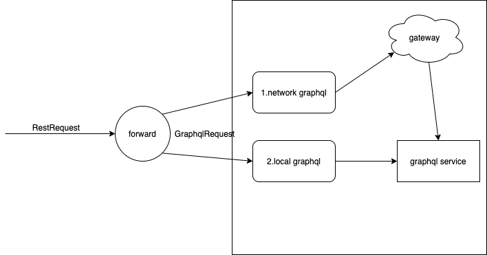

restful2graphql
--

## 概述

**目的：像使用 restful api 一样使用 graphql api**

基于纯 graphql 的后端服务，提供的 Open API 也是一个 graphql 接口。
对于不熟悉的人来说，可读性不高，使用不便，与现有广泛存在的 restful API 差异明显。

将 restful API 转发到 graphql API，大致分为两种方案
* 利用中间服务转发
* 在 graphql api 的原服务上，提供一个 restful 接口，负责处理请求，并调用本地的 graphql

## 方案比较

第一种：

**优点**

* 对原 graphql 代码无侵入性，不需要修改原服务，不用太关注原服务的授权和上下文，只需要像前端使用接口一样，直接调用
* 因为无侵入，通用性高，通过配置可以实现转发其他服务
* 对于公开接口而言，可读性高、易用（针对不熟悉 graphql 的人）
* 使得对资源的缓存容易在外部实现，利用 restful uri + param

**缺点**

* 丢失类型安全和错误校验功能，错误最终只能在 graphql 处理时才能判断，不能在 restful 转发到 graphql 时准确判断
* restful 处理转发到 graphql 时，丢失 graphql 的可选择性获取字段，组装等功能
* RequestBody 无法提前进行校验
* 需要一个新的转发服务
* 由于 graphql 必须指定返回字段，所以使用 restful 转换时，只能返回所有字段，又由于创建等操作实际接口只返回个别字段，此时转发时仍要求服务端返回所有字段会导致错误，需要额外支持字段排除
* 订阅功能缺失
* 需要实现接口的注册到服务注册中心

> 主要是因为 graphql 功能多、复杂，当做 restful 使用时，难免丢失一些功能。

第二种：

> 基于第一种，仍然需要生成graphql query，只是在请求接收到后，通过GraphQL对象，调用本地的graphql fetcher。

**优点**

* 不需要自己实现接口的服务注册，使用现有 graphql 服务中的即可
* 相比第一种，少一次网络转发，可以直接本地方法调用

**缺点**

* 对每个需要转发的服务，都需要额外编码
* 新增两个 restful api 接口请求，并调用 graphql.executeAsync

难点：

* query 拼接，这个可以使用自动生成工具，减小难度，不过目前只找到js平台的工具
* restful 映射到 graphql query
* 如何忽略自动生成的 graphql query 中的多余字段
* restful api 需要注册到服务注册中心供其他服务能调用（不关心被调用的 graphql api）

**示意图**



## 设计

无论是第一种和第二种，需要关注如何将 restful 的接口对应到 graphql 接口上。

我们知道，在 graphql 中只有一个请求URI，而 restful 是每个资源一个以上，且使用 HTTP 方法代表资源的操作。
fetcher name = 操作+资源，如创建用户变量：createUserVariable，查询所有用户变量：userVariables，删除用户变量：deleteUserVariable

约定对应关系如下：
针对通用 restful 接口，其中 requestBody 是可选，每个资源有以下七个独立接口，分四种HTTP方法类型：

实际 URI 只有两种格式

1. GET      /forward/projects/:project_id/:resource/:resource_id
2. GET      /forward/projects/:project_id/:resources
3. PUT      /forward/projects/:project_id/:resource/:resource_id             (requestBody)
4. PUT      /forward/projects/:project_id/:resources             (requestBody 有id)
5. POST     /forward/projects/:project_id/:resource             (requestBody)
6. DELETE   /forward/projects/:project_id/:resource/:resource_id 
7. DELETE   /forward/projects/:project_id/:resources          (requestBody)

- resource => graphql field operationName
    - 就是fetcher方法定义去掉get/update/delete/create等前缀，再把首字符转为小写，因为前缀已经由restful HTTP方法来表示
- requestBody => graphql field variables
- resource_id => graphql fetcher param 

查询单个、更新单个、删除单个必须有 resource_id 参数，其他批量操作使用 requestBody。

## 使用技术

* akka-http
* spray-json
* okhttp
* dryad

**注册实现**

* 采用 dryad，仅注册两个 URI `/forawrd/projects/([\w]+), /forawrd/projects/([\w]+)/([\w]+)`

目前只支持，标准 result api 的 crud 转发到 graphql 的 mutation 和 query 

1. 查询一个
2. 查询所有
3. 更新
4. 创建
5. 删除
6. 批量删除
7. 批量更新

第二种方案提供了 trait 封装，但没有提供接口，也没有测试。

## 示例

首先利用前端代码生成 graphql query 语句，每个 gql 对应服务端的一个 data fetcher 

- 使用 https://github.com/timqian/gql-generator 前端工具，自动生成 gql。
- 执行 gqlg --schemaFilePath src/main/resources/all.graphql --destDirPath src/main/resources/gql --depthLimit 5

在 all.graphql 中是所有需要转发的 graphql schmea。最终会在 gql/ 目录下生成所有 *.gql 语句。

> 这里自动生成的语句实际会有很多的多余字段，需要排除掉。

1. 所有 graphql schema 放在 all.graphql 中
2. 启动 Rest2GraphqlForwardServer.scala
3. 使用 restful 请求 graphql

**使用 restful 完成 crud**

- GET http://localhost:8080/forward/projects/WlGk4Daj/userVariables 
    - 将会使用 HTTP 调用 graphql api: `userVariables: [UserVariable]`
- POST http://localhost:8080/forward/projects/WlGk4Daj/userVariable 
    - 将会使用 HTTP 调用 graphql api: `createUserVariable(userVariable: VariableInput!): UserVariable!`
    - requestBody 
```json
{
    "userVariable": {
        "name": "测试graphql",
        "key": "test_132",
        "valueType": "int",
        "description": "132"
    }
}
```
如果使用 graphql ，那么这个请求体长这样：
```json
{
    "operationName": "createUserVariable",
    "variables": {
        "userVariable": {
            "name": "测试graphql",
            "key": "test_132",
            "valueType": "int",
            "description": "132"
        }
    },
    "query": "mutation createUserVariable($userVariable: VariableInput!) {\n  createUserVariable(userVariable: $userVariable) {\n    name\n    __typename\n  }\n}\n"
}
```
对用户来说，query 的拼写是痛苦的。

- DELETE http://localhost:8080/forward/projects/WlGk4Daj/userVariable/y9pmLdQm # y9pmLdQm是一个HashId
    - 将会使用 HTTP 调用 graphql api: `deleteUserVariable(id: HashId!): Boolean!`
- PUT http://localhost:8080/forward/projects/WlGk4Daj/userVariable/y9pmLdQm
    - 将会使用 HTTP 调用 graphql api: `updateUserVariable(id: HashId!, userVariable: VariableInput!): UserVariable!`
    - requestBody 当 id 字段在路径参数和 requestBody 都存在时，只会使用路径参数的
```json
{
    "userVariable": {
        "name": "测试graphql",
        "key": "test_132",
        "valueType": "int",
        "description": "132"
    }
}
```

## 可选配置

```
graphql {

  #1.直接将 schema 放在里面，或者其他schema合并后放到这里面，不要与放在`src/main/resources/gql`目录，会被覆盖
  #2.该路径对应 gqlg --schemaFilePath参数的值
  schema.path = "src/main/resources/all.graphql"
  #3.`src/main/resources/gql`，该路径对应 gqlg --destDirPath 参数的值
  gql.folder = "gql"
  exclude {
   # 因为定义的是必须存在，查出的数可能为空，不兼容，需要排除，对于嵌套逻辑只需要排除最外层
   # 之所以配置是这样的，是因为生成的 graphql query 就是空格隔开，这样不需要的字段，直接粘贴复制到这里即可
   userVariables = "projectId type valueType"
   createUserVariable = "id projectId key type description isSystem creatorId createdAt updaterId updatedAt creator updater valueType "
   updateSegment = "projectId description compute scheduler creatorId createdAt updaterId updatedAt creator updater createdBy detector"
   createSegment = "projectId description compute scheduler creatorId createdAt updaterId updatedAt creator updater createdBy detector"
  }

  # graphql服务的地址
  # url = "http://localhost:8086/projects/%s/graphql"

  # 此地址的 graphql 请求是经过 gateway 的
  url = "http://gdp-dev.growingio.com/graphql"

  # graphql鉴权请求头的key，应该在 restful 请求时携带服务器的InternalToken，这里默认使用 cookie （可以使用 token 或者 cookie）
  auth {
    # 必须传
    key = "Cookie"
  }
}

# dryad框架的参数
dryad {

  enabled = false

  namespace = "gio-graphql-forawrd"
  group = "k8s-datatest"

  provider = "io.growing.dryad.consul.provider.ConsulConfigProvider"
  registry = "io.growing.dryad.consul.registry.ConsulServiceRegistry"

  service {
    http {
      # 转发接口的预定义前缀，目前只支持：/forward/projects/:project_id和/forward/projects 两种路径，其中单词可以替换，分隔符数量不能改
      prefix = "/forward/projects/:project_id"
      port = 8080
      pattern = "/.*"
      check {
        url = "/healthy-check"
        interval = 5s
      }
    }
  }

  consul {
    host = "ci-consul.infra.growingio.com"
    port = 80
    username = "x"
    password = "x"
  }

}
```